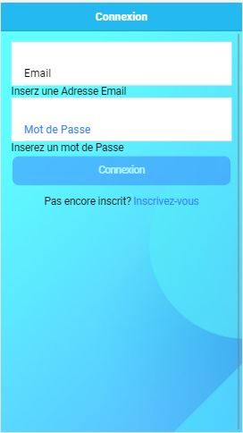
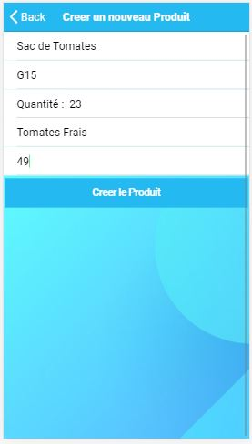
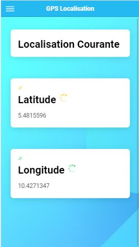
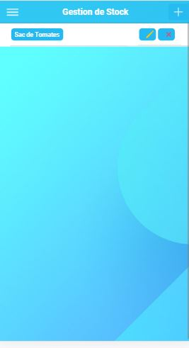
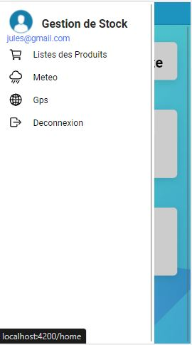
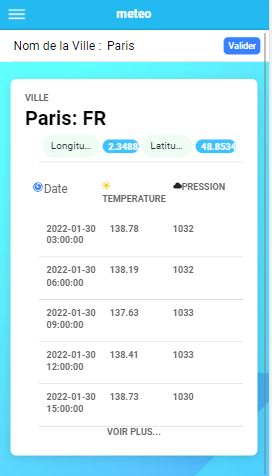
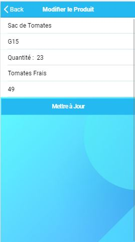
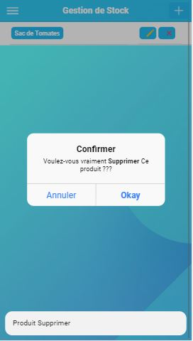

#  Objectif du TP Gestion de Stocks

1. Amélioration des visuels
2. Integration d'une base de données (Google firebase)
3. Ajouter un nouveau bouton dans le formulaire de création de produits (juste la référence sera sauvegarde dans la BD)
4. Dans le menu de gestion de position les coordonnées GPS seront sauvegardées dans une base de données locale. 
5. La page d'affichage de la météo devrait aussi être optimise ( visuelle)

L'api d'openweathermap à été utilisé pour la méteo
<div>
  
  
  
  
  
  
  
  
</div>


##  Installation

```
npm install
```
###  Lancer l'application
```
ionic serve
```
